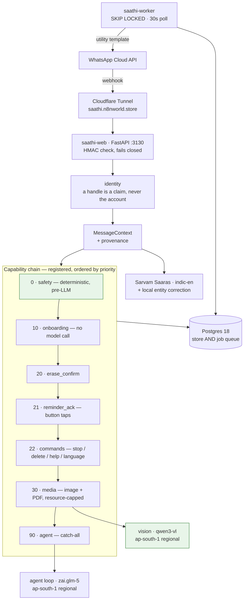

# Saathi — an AI companion for elders

> **An AI companion for older adults in India, on WhatsApp.**
> It remembers, reminds, reads and assembles — and never transacts.
> Voice-first and Indic-first. Every task
> ends in something the user acts on themselves: a reminder, an answer, a
> shortlist, a link they tap. No payment credentials, no OTPs, no account access,
> no agent-initiated spend.

Private repo. Live at **`saathi.n8nworld.store`** (webhook) and
**`n8nworld.store`** (public site). Runtime is a single box in **AWS ap-south-1
(Mumbai)** — see [`docs/RUNBOOK.md`](docs/RUNBOOK.md).

**In production since 2026-07-27.** Users reach it on **+91 8071 581 944**,
where it answers as **Indofolk AI** — the Meta-approved display name on WABA
`1687148075730227`, verified to Indofolk Wellness Private Limited, billed in INR.
`Saathi` remains the name of the codebase, the services and this repo; the two
are deliberately not the same, because "Saathi" was rejected under Meta's
[display-name guidelines](https://www.facebook.com/business/help/757569725593362)
as a generic term. **User-facing copy says Indofolk AI. Everything internal says
Saathi.** Do not "fix" one to match the other.

---

## Branch rules — read this first

**Two branches, two different things. Do not mix them.**

| Branch | Contains | Deploys to | How |
|---|---|---|---|
| **`main`** | The application — Python, FastAPI, worker, tests | the ap-south-1 box | `ops/deploy.sh` — S3 artifact + SSM from the dev box, or `--local` on the box itself |
| **`site`** | The public site — Next.js static export, policy pages | Cloudflare Pages → `n8nworld.store` | git push (CF builds `site` only) |

- **Application work goes on `main`.** Never put site code there.
- **Site and policy-page work goes on `site`.** Never put application code there.
- Cloudflare Pages is configured `production_branch: site` with
  `preview_branch_excludes: ["main"]`, so a push to `main` will **not** trigger a
  site build. It used to: Pages ran `npx next build` against the Python repo and
  failed on every commit. If you see that error again, check this setting first.
- Push to **both remotes, every time**:
  ```
  git push origin <branch> && git push gitlab <branch>
  ```
  origin = GitHub `Nuraveda-Labs/saathi` · gitlab = GitLab `nuraveda-lab/saathi`
- Every commit is authored `Tejas Karan Agrawal <help.nuraveda@gmail.com>`, and
  **SSH-signed when authored on the dev box**, which holds the signing key.
  Commits authored on the runtime box are unsigned by necessity — see
  `DECISIONS.md` D-L. Signing is not a gate on landing work.
- **`%G?` is not a usable check on either box.** SSH signature *verification*
  needs `gpg.ssh.allowedSignersFile`, which is unset, so correctly signed commits
  still report `N`. It has already sent one session chasing a phantom. To ask
  whether a commit is signed at all:
  ```
  git cat-file commit HEAD | grep -q '^gpgsig' && echo signed
  ```
- The GitLab token is an OAuth grant that **expires every two hours** and its
  credential helper does not refresh it, so a push can succeed on GitHub and fail
  on GitLab, leaving them diverged. Refresh with `glab api user`, then verify
  both by hash rather than trusting two exit codes.

---

## What it is (the 60-second version)

India has ~615M WhatsApp users and the 56+ segment is the fastest growing. ~40%
of Indian seniors own a smartphone, but **66% find digital tools confusing** and
**51% fear making errors**. Distribution is already solved; the interface *is*
the product.

So Saathi is not a chat box with a model behind it, and it is not a bot. It is
a **companion** — warm, patient, and the same on the fourth asking as the first
— built around four capabilities and a set of refusals:

- **Remembers** — facts stored explicitly by tool call, never inferred into an
  opaque blob. "What do you know about me?" and "forget that" both work.
- **Reminds** — RRULE recurrence, timezone-correct, acknowledged and snoozeable,
  fired as approved WhatsApp *utility* templates.
- **Reads** — a photo of a medicine pack, a letter, a forwarded PDF.
- **Assembles** — a numbered shopping list they can read or forward.

**The refusals are the design.** No tool can move money, read an OTP, or touch a
third-party account — so prompt injection via a forwarded message is
*structurally* incapable of causing harm, not merely discouraged by a prompt.

---

## Architecture



Everything runs on one box in ap-south-1. **No inbound port is open to the
application** — user traffic arrives only through the Cloudflare tunnel, and
`:3130` binds `127.0.0.1`. The box itself has exactly one inbound rule: TCP 22
from the operator's Mac (`207.219.25.137/32`), for operator SSH.

### Adding a capability

Register it. Do not edit the pipeline — a test asserts the dispatcher never
names an individual capability.

```python
register(simple("weather", 60,
                lambda ctx: "mausam" in ctx.text.lower(),
                handle_weather))
```

Priority bands: `0–9` safety · `10–19` onboarding · `20–29` commands and
confirmations · `30–49` media · `50–89` capabilities · `90–99` the agent.

Two things that look like details and are not. A capability that acts on user
text must check `ctx.trusted` — omitting it is how a *forwarded* message once
reached the deterministic command path. And match on anchored patterns, not
substrings: `unsubscribe` contains `stop`, and both reached state-changing
behaviour.

### The boundaries that matter

| Boundary | Why it is built this way |
|---|---|
| **Safety is a regex at priority 0** | A forwarded scam will argue with a prompt instruction. It cannot argue with a function that already returned. A test fails if the agent is reachable on an emergency message. |
| **Capability is defined by absence** | The §12 guarantee lives in what is *not* in the tool list. `assert_no_forbidden_tools()` fails the suite if a transactional tool appears. |
| **Forwarded content is data, never command** | Text the user did not author drops to `RELAYED` and state-mutating tools are withheld for that turn. Withholding beats filtering: an absent capability does not care how the attack is phrased. |
| **The 24-hour window is a hard gate** | Every send funnels through one function that checks it, so you cannot send by forgetting to check. |
| **Inference stays in India** | `zai.glm-5` and `qwen3-vl` are *regional* ap-south-1 endpoints. The Anthropic models here are `global.`-only and would send a photo of someone's prescription abroad. |
| **Onboarding never calls the model** | Which is what makes "anyone may message us" safe rather than an open cost vector. |
| **No prompt caching** | Unsupported on this model, so cost is linear in prompt size and the prefix has a hard budget (`SAATHI_PREFIX_TOKEN_BUDGET`, measured ~1,330 of 3,000). |

---

## Layout

    saathi/
      web/            FastAPI — webhook (verify + signed receive), healthz
      wa/             Cloud API client, 24h window guard, templates, formatter
      channels/       Transport protocol + Capabilities as data
      core/           MessageContext, handler registry, backpressure gates
      capabilities.py the capability chain — read it top to bottom
      speech/         ffmpeg transcode, Saaras STT, entity correction
      agent/          tool loop, streaming, prompt + prefix budget, tools
      safety/         deterministic pre-LLM classifier
      vision.py       medicine packs, letters, photos
      documents.py    PDF text layer first, rasterise as fallback — page, byte,
                      wall-clock and rlimit caps, because a sender chooses this
      identity.py     users, handles, linking, dormancy
      provenance.py   trust of inbound content
      net_policy.py   SSRF blocking + secret redaction
      memory.py       facts, ASR bias vocabulary, erasure
      onboarding.py   deterministic, button-driven, model-free, language-first
      scheduling.py   the `scheduled_turns` queue — enqueue, claim, sweep_stuck
      worker/turns.py every kind of future work, registered: reminder, nudge,
                      checkin, media_purge. Read it top to bottom.
    db/               extensions.sql (superuser), schema.sql, migrations/,
                      schema_migrations.sql + record_migration.sql (the ledger —
                      deploy bookkeeping, deliberately not a migration)
    ops/              deploy.sh (transport) · deploy_onbox.sh (everything that
                      happens on the box, run by both transports) ·
                      deploy_verify.sh · alerting/
    docs/             start at DOC_SYSTEM.md

---

## Getting started

```bash
uv sync --extra dev
createdb saathi
psql -d saathi -f db/extensions.sql            # superuser — pg_trgm is untrusted
psql -d saathi -f db/schema.sql                # run as the app role, so it owns its tables
for m in db/migrations/*.sql; do psql -d saathi -v ON_ERROR_STOP=1 -f "$m"; done
cp .env.example .env && chmod 600 .env         # never commit this
uv run pytest -q
uv run uvicorn saathi.web.app:app --port 3130
```

Migrations are **not** all safe to re-run — 003 and 005 end in backfill
`update`s that are wrong the second time. On the box `ops/deploy.sh` keeps a
`schema_migrations` ledger and skips what it has already applied; a database you
migrate by hand like this gets its ledger on the first deploy, by baselining
what it finds. Locally, run the loop once.

On the box, secrets are fetched rather than typed: `saathi-env-sync`.
**Never put a secret in an SSM command** — command text is retained and visible
in the AWS console.

## Deploying

```bash
ops/deploy.sh                  # from the dev box — artifact to S3, driven over SSM
sudo ops/deploy.sh --local     # standing on the runtime box itself
sudo ops/deploy.sh --local --check   # verify only, changes nothing
```

Both routes run the same `ops/deploy_onbox.sh`, so there is one copy of the
install / migrate / test / restart logic and not two that can drift. `--local`
must positively match the target instance id and refuses if it cannot read one;
the SSM route refuses when run *on* the target. Both refuse a dirty tree or a
branch other than `main`, snapshot the tree to `<repo>.prev/` first, and **stop
before the restart** if a migration, `uv sync`, `saathi-env-sync` or the test run
fails.

Never hand-roll the tar/S3/SSM sequence, and never copy modules onto the box by
hand. Both have been done, both are recorded, and the second is what left the box
looking hand-edited for a day.

---

## Docs

Start at **[`docs/DOC_SYSTEM.md`](docs/DOC_SYSTEM.md)** — it says what to read,
in what order, before writing code.

| Doc | What it is |
|---|---|
| [`docs/PRD.md`](docs/PRD.md) | The product argument. §0 lists which of its technical claims have since been measured wrong. |
| [`docs/ARCHITECTURE.md`](docs/ARCHITECTURE.md) | The boundaries, and why each one exists. |
| [`docs/DECISIONS.md`](docs/DECISIONS.md) | Hard-to-reverse choices, with reasons and dates. |
| [`docs/RUNBOOK.md`](docs/RUNBOOK.md) | Deploy, verify, recover. Infrastructure IDs. |
| [`docs/LANDMINES.md`](docs/LANDMINES.md) | **Read before touching Meta, Cloudflare or audio.** |
| [`docs/PROD_READINESS.md`](docs/PROD_READINESS.md) | What is knowingly unfinished, and what breaks in production if it stays that way. |
| [`docs/STUDY_OPENCLAW.md`](docs/STUDY_OPENCLAW.md) | What we took from OpenClaw, and what we deliberately did not. |
| [`docs/ENGINEERING_SUPERVISOR.md`](docs/ENGINEERING_SUPERVISOR.md) | Append-only lane log. Evidence, not intentions. |
| [`CHANGELOG.md`](CHANGELOG.md) | Code changes — and what broke finding them out. |

---

## House rules

- **Existence is not function.** Prove behaviour with live evidence before
  calling it done. `ffmpeg -version` passed happily while every voice note failed.
- **A green test is not evidence that the test is watching.** Five separate bugs
  here shipped with passing tests that *agreed with the bug*, because the
  assertion was written from the implementation instead of the contract. The
  check that works is mechanical: delete the **call** from the production path —
  not the function body — and require the test to go red. If it stays green, it
  was never testing the thing.
- **Value-blind secrets.** Never echo a token; verify by length and hash prefix.
  Delete synthetic test rows after verifying.
- **Fail loudly, never fail open.** A control that degrades to "allow" on
  malformed input is not a control.
- **Never disturb MeshPilot.** Its checkout serves live customers. Saathi reads
  from it at most; it never writes.
